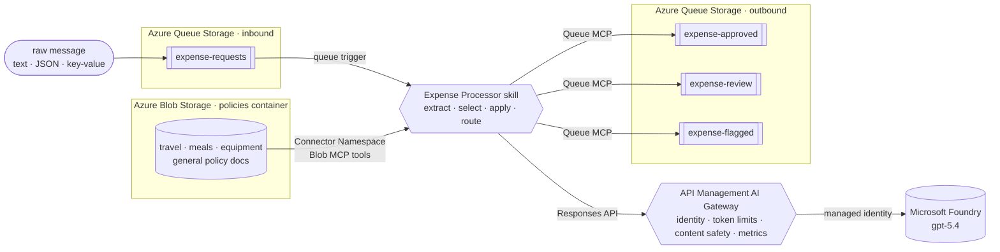

# Azure Functions Hosted Skill: Expense Processor [](https://www.python.org/downloads/)

A markdown-first Azure Functions hosted skill for queue-driven expense processing. Its trigger and
instructions live in
[`src/expense_processor.agent.md`](src/expense_processor.agent.md), and Azure Functions
handles execution and scale-to-zero.

## What it does

- 🧾 **Reads any format:** text, email, key/value, or JSON, and normalizes amounts expressed with
  symbols, currency codes, words, or colloquial units.
- 📚 **Picks the right policy:** lists the documents in Blob Storage and selects the one whose scope
  matches, then reads and applies it through a read-only Connector Namespace MCP server.
- 🛡️ **Governs model calls:** sends deployed model traffic through an Azure API Management AI
  Gateway with managed identity, token limits, prompt shielding, harmful-input filtering, and token
  metrics.
- 🚦 **Routes the decision:** `approve` → `expense-approved`, `review` → `expense-review`,
  `flag` / FX → `expense-flagged`.
- 🔀 **Proves it's reasoning:** the same normalized 450 USD is auto-approved as travel but sent to
  review as a client dinner; tighten one policy document and only that category reroutes.

## Prerequisites

- An [Azure subscription](https://azure.microsoft.com/free/)
- [uv](https://docs.astral.sh/uv/)
- [Azure Developer CLI (`azd`)](https://learn.microsoft.com/azure/developer/azure-developer-cli/install-azd)

The deployment creates an API Management **Developer** instance. This is the lowest tier that
supports the sample's token-limit and Content Safety policies, but it has a recurring cost and no
production SLA.

## Quickstart

```bash
uv sync --project src
azd auth login
azd up
```

The deployment seeds the policy documents but does not submit expenses, so a fresh deployment's
queues remain empty. Verify the empty output queues:

```bash
uv run --project src --no-sync python scripts/read_decision.py --queue all --peek --cloud
```

Submit the three bundled demo expenses, allow up to two minutes for processing, and read the
resulting decisions:

```bash
uv run --project src --no-sync python scripts/setup_demo.py send-samples
uv run --project src --no-sync python scripts/read_decision.py --queue all --peek --cloud
```

`send-samples` skips submission when an output queue already contains a decision. To reset the
three output queues for a fresh demo, receive and remove their messages, then run `send-samples`
again:

```bash
uv run --project src --no-sync python scripts/read_decision.py --queue all --cloud --max 1000
```

Omitting `--peek` deletes the messages it reads. This command clears the three output queues; it
does not clear the input or poison queue. The `--no-sync` commands reuse the environment prepared by
the initial `uv sync --project src` and do not contact PyPI.

You should then see:

| Request as received | Amount inferred | Policy | Queue |
|---|---:|---|---|
| “four hundred and fifty dollars” flight | 450 USD | `travel-policy.md` | `expense-approved` |
| `USD 450.00` monitor | 450 USD | `equipment-software-policy.md` | `expense-approved` |
| `$450` client dinner | 450 USD | `meals-entertainment-policy.md` | `expense-review` |

Open the Application Insights overview, then use **Search** (formerly **Transaction search**) or
**Logs** to inspect the hosted skill, model calls, and tool spans:

```bash
azd monitor --overview
```

Look for successful `execute_tool azureblob_ListFolder_V4`,
`execute_tool azureblob_GetFileContentByPath_V2`, and
`execute_tool azurequeues_PutMessage_V2` spans, plus AI Gateway requests and token metrics. See
[Deploy](docs/deploy.md#show-the-telemetry) for the portal walkthrough.

Clean up with `azd down --purge`.

## Run it locally

Install [Azurite](https://learn.microsoft.com/azure/storage/common/storage-use-azurite) and
[Azure Functions Core Tools](https://learn.microsoft.com/azure/azure-functions/functions-run-local).
Copy [`src/local.settings.json.sample`](src/local.settings.json.sample) to `src/local.settings.json`
and set the model endpoint and deployment. No API key is needed; the runtime uses
`DefaultAzureCredential`, so sign in with `az login` or `azd auth login`. Policy lookup uses the
deployed Connector Namespace because Connector Namespace has no local emulator. After
`azd provision`, copy
`POLICY_MCP_SERVER_URL` and `QUEUE_MCP_SERVER_URL` from `azd env get-values` into local settings
and leave both MCP client IDs empty so your developer credential is used.

```bash
azurite --silent --location .azurite               # terminal A
cd src && uv run func start                         # terminal B
uv run --project src --no-sync python scripts/send_expense.py --file samples/travel.txt   # terminal C
uv run --project src --no-sync python scripts/read_decision.py --queue all --peek --cloud
```

The model call and both Connector Namespace MCP servers still use Azure. The local trigger reads
Azurite, but decisions are written to the deployed Azure output queues because Connector Namespace
has no local emulator. For setup and Windows help, see
[Troubleshooting](docs/troubleshooting.md).

## How it works



The runtime discovers the hosted skill's Markdown definition. Its front matter defines the queue
trigger, and its body contains the instructions. A read-only Azure Blob MCP connector lists and
reads policy documents, while a write-only Azure Queues MCP connector routes decisions to the three
output queues. The Connector Namespace managed identity receives container-scoped Blob Reader and
queue-scoped Message Sender roles. In Azure, model requests use the Function identity to enter the
AI Gateway; API Management then calls Microsoft Foundry with its own managed identity.

[How it works](docs/how-it-works.md) · [Use cases](docs/use-cases.md) ·
[Customize](docs/customize.md) · [Deploy](docs/deploy.md) ·
[Troubleshooting](docs/troubleshooting.md)

## Learn more

- [Hosted skills in Azure Functions](https://learn.microsoft.com/azure/azure-functions/functions-serverless-agents-runtime)
- [Azure Functions Flex Consumption](https://learn.microsoft.com/azure/azure-functions/flex-consumption-plan)
- [Connector Namespace](https://learn.microsoft.com/azure/connector-namespace/connector-namespace-overview)
- [Generative AI gateway capabilities](https://learn.microsoft.com/azure/api-management/genai-gateway-capabilities)
- [uv](https://docs.astral.sh/uv/) · [PEP 723: inline script metadata](https://peps.python.org/pep-0723/)

## License

[MIT](LICENSE) © Microsoft Corporation.
