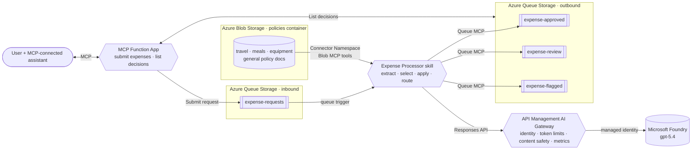

# Azure Functions Hosted Skill: Expense Processor [](https://www.python.org/downloads/)

A markdown-first Azure Functions hosted skill for queue-driven expense processing. Its trigger and
instructions live in
[`src/expense_processor.agent.md`](src/expense_processor.agent.md), and Azure Functions
handles execution and scale-to-zero.

A separate [Functions hosted MCP server](docs/mcp.md) lets an MCP-connected assistant submit expenses and list available decisions. Both apps deploy with `azd up`.

## What it does

- 🧾 **Reads any format:** text, email, key/value, or JSON, and normalizes amounts expressed with
  symbols, currency codes, words, or colloquial units.
- 📚 **Picks the right policy:** lists the documents in Blob Storage and selects the one whose scope
  matches, then reads and applies it through a read-only Connector Namespace MCP server.
- 🛡️ **Governs model calls:** sends deployed model traffic through an Azure API Management AI
  Gateway with managed identity, token limits, prompt shielding, harmful-input filtering, and token
  metrics.
- 🚦 **Routes the decision:** `approve` → `expense-approved`, `review` → `expense-review`,
  `flag` / FX → `expense-flagged`.
- 🔀 **Proves it's reasoning:** the same normalized 450 USD is auto-approved as travel but sent to
  review as a client dinner; tighten one policy document and only that category reroutes.

## Prerequisites

- An [Azure subscription](https://azure.microsoft.com/free/)
- [uv](https://docs.astral.sh/uv/)
- [Azure Developer CLI (`azd`)](https://learn.microsoft.com/azure/developer/azure-developer-cli/install-azd)
- An MCP client such as GitHub Copilot agent mode in VS Code, for request submission
- Permission to create Microsoft Entra app registrations, for MCP sign-in

The deployment creates an API Management **Developer** instance. This is the lowest tier that
supports the sample's token-limit and Content Safety policies, but it has a recurring cost and no
production SLA.

## Quickstart

```bash
uv sync --project src
uv sync --project mcp-server
azd auth login
azd env set PRE_AUTHORIZED_CLIENT_IDS aebc6443-996d-45c2-90f0-388ff96faa56
azd up
```

The client ID above identifies
VS Code and explicitly authorizes it to sign in to this MCP server. Other clients are not
automatically authorized: configure their application IDs in `PRE_AUTHORIZED_CLIENT_IDS` as a
comma-separated list, then provision again.

One `azd up` provisions and deploys both apps in separate resource groups:

| Resource group | Resources |
|---|---|
| `rg-<environment>` | Expense Processor app, expense queues and policies, Connector Namespace, AI Gateway, Foundry, hosting plan, identity, Application Insights, and Log Analytics workspace |
| `rg-<environment>-mcp` | MCP app, storage account, hosting plan, identity, Application Insights, and Log Analytics workspace |

The deployment also creates a Microsoft Entra app registration for MCP authentication and
preauthorizes the clients you configured. Azure resource permissions alone do not grant permission to create
Entra app registrations.

## Test the expense processor

The deployment seeds the policy documents but does not submit expenses, so a fresh deployment's queues remain empty.

You can use the VS Code Copilot to submit expense requests conversationally through the MCP server.

### Connect in VS Code Copilot

1. Run `azd env get-values` and copy `EXPENSE_MCP_SERVER_URL`, the full endpoint including
   `/runtime/webhooks/mcp`.
2. Open [`.mcp.json`](.mcp.json) and set **expenseRemoteServer**'s `url` to that endpoint.
   In VS Code, run **MCP: Add Server** from the Command Palette, select **HTTP**, and enter the
   endpoint with the name **expenseRemoteServer**. Start it using **MCP: List Servers**.
   Keep **expenseLocalServer** stopped while using the deployed server.
3. When prompted, sign in with an account in the deployment's Microsoft Entra tenant.
4. Open Copilot Chat in **Agent** mode and enable the expense server's tools. Approve tool calls
   when prompted.

### Submit expenses and list decisions

Ask Copilot to submit a request. For example:

> Submit an expense for my flight to the customer meeting. Contoso Air charged four hundred and fifty dollars. Preserve my original wording when submitting it.

You should see Copilot invoke the relevant tool in the server to submit the request and return a request ID.

Allow up to two minutes for processing, then ask:

> List the available expense decisions and explain the policy and reason for each.

Other examples:

> Submit an equipment expense: USD 450.00 for a monitor from Contoso Electronics.

> Submit a client entertainment expense: $450 for dinner with a customer at Contoso Bistro.

To reset the demo, wait for processing to finish, then ask:

> Reset the demo results. I approve deleting all decisions in the three output queues.

### Inspect telemetry

Open the Application Insights overview, then use **Search** (formerly **Transaction search**) or
**Logs** to inspect the hosted skill, model calls, and tool spans:

```bash
azd monitor --overview
```

Use the processor's Application Insights for the hosted skill and AI Gateway; the MCP app has
its own Application Insights in `rg-<environment>-mcp`.

Look for successful `execute_tool azureblob_ListFolder_V4`,
`execute_tool azureblob_GetFileContentByPath_V2`, and
`execute_tool azurequeues_PutMessage_V2` spans, plus AI Gateway requests and token metrics. See
[Deploy](docs/deploy.md#show-the-telemetry) for the portal walkthrough.

Clean up with `azd down --purge`.
This removes the deployed sample resources in both resource groups.

## Run it locally

Install [Azurite](https://learn.microsoft.com/azure/storage/common/storage-use-azurite) and
[Azure Functions Core Tools](https://learn.microsoft.com/azure/azure-functions/functions-run-local)
**4.8.0 or later**.

### Configure the hosted skill

1. Copy [`src/local.settings.json.sample`](src/local.settings.json.sample) to
   `src/local.settings.json`. Keep `AzureWebJobsStorage` set to `UseDevelopmentStorage=true`.
2. Set `AZURE_OPENAI_ENDPOINT` and `AZURE_OPENAI_DEPLOYMENT` to the model endpoint and deployment
   you want to use.
3. After `azd provision`, copy `POLICY_MCP_SERVER_URL` and `QUEUE_MCP_SERVER_URL` from
   `azd env get-values` into local settings. Leave `POLICY_MCP_CLIENT_ID` and `QUEUE_MCP_CLIENT_ID`
   empty.
4. Sign in with `az login` or `azd auth login`. The runtime uses `DefaultAzureCredential`;
   no model API key is needed.

> The model call and both Connector Namespace MCP servers still use Azure. The local trigger reads
> Azurite, but decisions are written to the deployed Azure output queues because Connector Namespace
> has no local emulator. For setup and Windows help, see [Troubleshooting](docs/troubleshooting.md).

### Configure the MCP server

1. Copy [`mcp-server/local.settings.json.sample`](mcp-server/local.settings.json.sample) to
   `mcp-server/local.settings.json`.
2. Configure the values below. Get `OUTPUT_STORAGE_ACCOUNT` from `azd env get-values`.
3. Leave `ExpenseStorage__credential` and `ExpenseStorage__clientId` unset to use your signed-in
   developer identity.

| Setting | Local value | Purpose |
|---|---|---|
| `AzureWebJobsStorage` | `UseDevelopmentStorage=true` | MCP app host storage |
| `ExpenseInputStorage` | `UseDevelopmentStorage=true` | Submit requests to the local hosted skill |
| `ExpenseStorage__queueServiceUri` | `https://<OUTPUT_STORAGE_ACCOUNT>.queue.core.windows.net` | List and reset decisions in Azure |

### Start the local services

Start each terminal from the repository root. Start Azurite first; the two Function Apps can
then start in either order. Reuse Azurite if it is already running.

**Terminal A — Azurite**

```bash
azurite --silent --location .azurite
```

**Terminal B — hosted skill**

```bash
cd src && uv run func start --port 7071
```

**Terminal C — MCP server**

```bash
cd mcp-server && uv run func start --port 7072
```

### Test locally with Copilot

1. In VS Code's **MCP: List Servers**, stop **expenseRemoteServer**.
2. Use **MCP: Add Server** to register the HTTP endpoint for **expenseLocalServer** from
   [`.mcp.json`](.mcp.json): `http://localhost:7072/runtime/webhooks/mcp`. Start the local server.
3. In Copilot **Agent** mode, submit expenses and list decisions using the same prompts and tool
   approvals as in [Test the expense processor](#test-the-expense-processor).

Both Function Apps run locally. Requests go through Azurite to the local hosted skill, while
the list and reset tools access the Azure decision queues.

## How it works



The MCP server lets an AI assistant submit expense requests to the input queue and retrieve
decisions from the output queues. The hosted skill evaluates the requests; the MCP server provides
the tools for users to interact with it conversationally. See the
[MCP server architecture](docs/mcp.md#mcp-server-architecture) for the tool-level queue connections
and the MCP app's storage boundary.

The runtime discovers the hosted skill's Markdown definition. Its front matter defines the queue
trigger, and its body contains the instructions. A read-only Azure Blob MCP connector lists and
reads policy documents, while a write-only Azure Queues MCP connector routes decisions to the three
output queues. The Connector Namespace managed identity receives container-scoped Blob Reader and
queue-scoped Message Sender roles. In Azure, model requests use the Function identity to enter the
AI Gateway; API Management then calls Microsoft Foundry with its own managed identity.

[Functions MCP demo](docs/mcp.md) · [How it works](docs/how-it-works.md) · [Use cases](docs/use-cases.md) ·
[Customize](docs/customize.md) · [Deploy](docs/deploy.md) ·
[Troubleshooting](docs/troubleshooting.md)

## Send expense request manually

Use MCP for the conversational walkthrough. The scripts are an optional alternative for submitting
requests and inspecting decisions _without_ an agent or MCP client. Run the commands below from the
repository root.

### Test the provisioned app

Verify the empty output queues:

```bash
uv run --project src --no-sync python scripts/read_decision.py --queue all --peek --cloud
```

Submit the three bundled demo expenses, allow up to two minutes for processing, and read the
resulting decisions:

```bash
uv run --project src --no-sync python scripts/setup_demo.py send-samples
uv run --project src --no-sync python scripts/read_decision.py --queue all --peek --cloud
```

`send-samples` skips submission when an output queue already contains a decision. To reset the
three output queues for a fresh demo, receive and remove their messages, then run `send-samples`
again:

```bash
uv run --project src --no-sync python scripts/read_decision.py --queue all --cloud --max 1000
```

Omitting `--peek` deletes the messages it reads, up to 1,000 per output queue in this command; it
does not clear the input or poison queue. The `--no-sync` commands reuse the environment prepared by
the initial `uv sync --project src` and do not contact PyPI.

With the bundled policies, these requests produce:

| Request as received | Amount inferred | Policy | Queue |
|---|---:|---|---|
| “four hundred and fifty dollars” flight | 450 USD | `travel-policy.md` | `expense-approved` |
| `USD 450.00` monitor | 450 USD | `equipment-software-policy.md` | `expense-approved` |
| `$450` client dinner | 450 USD | `meals-entertainment-policy.md` | `expense-review` |

### Test local app

After [starting the local services](#start-the-local-services), run these commands in
another terminal:

```bash
uv run --project src --no-sync python scripts/send_expense.py --file samples/travel.txt
uv run --project src --no-sync python scripts/read_decision.py --queue all --peek --cloud
```

The submission goes to the local Azurite input queue; decisions are read from the deployed output
queues because the hosted skill's queue MCP connector still uses Azure.

## Learn more

- [Hosted skills in Azure Functions](https://learn.microsoft.com/azure/azure-functions/functions-serverless-agents-runtime)
- [Azure Functions Flex Consumption](https://learn.microsoft.com/azure/azure-functions/flex-consumption-plan)
- [Connector Namespace](https://learn.microsoft.com/azure/connector-namespace/connector-namespace-overview)
- [Generative AI gateway capabilities](https://learn.microsoft.com/azure/api-management/genai-gateway-capabilities)
- [uv](https://docs.astral.sh/uv/) · [PEP 723: inline script metadata](https://peps.python.org/pep-0723/)

## License

[MIT](LICENSE) © Microsoft Corporation.
