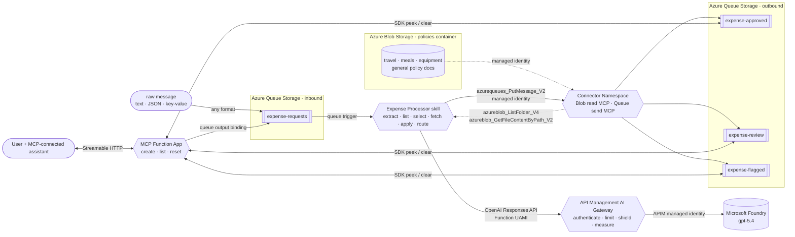

# How it works

A message lands on the `expense-requests` queue and triggers exactly one hosted skill run over that
item. There's no hand-written parser and no rules engine. The skill reads the raw message, works out
which spending policy applies, fetches that policy from Blob Storage, applies it, and routes its
decision to the right queue.

## Why a hosted skill, and not a rules engine?

Expense and purchase-order requests rarely arrive as clean, validated JSON. They show up as Slack
messages, forwarded emails, quick notes, or half-structured text from a dozen intake tools, and a
real finance org doesn't run every one through the *same* rulebook. Travel, meals, and capital
equipment each have their own thresholds and their own exceptions. A traditional function would need
a parser for every format and a rules engine that encodes every policy.

This sample replaces that with a single **markdown-defined hosted skill**. The decision isn't a field
lookup or an `if/else` on a number. It uses *retrieval + selection + reasoning*: the skill reads a messy,
human-written message, extracts the amount / currency / category / vendor, **chooses the right policy
from several**, reads that natural-language document, and reasons over the two together.

Because the policies are **documents the skill reads at runtime**, and it *chooses among them*, the
people who own spending policy can change how a whole category is triaged, or add a brand-new policy,
by editing files. No engineer, no deploy. See [use-cases.md](use-cases.md) for the proof that it's
genuinely reasoning rather than matching a fixed schema.

## Architecture

The user-facing [MCP Function App](mcp.md) is separate from the Expense Processor skill. Its create
tool uses a queue output binding; its list/reset tools use the Queue SDK. The skill evaluates
expenses using policies and Connector Namespace tools; the MCP Function App does not call a model.
The apps and their dependencies are deployed in separate resource groups. Each owns its storage,
plan, identity, Application Insights and Log Analytics workspace; the integration passes the
expense queue endpoint and grants the MCP identity queue-scoped access.



It runs on **Azure Functions Flex Consumption**, so it scales to zero and costs nothing when the
queue is empty. The API Management Developer gateway does not scale to zero and has a recurring
cost; it is selected because Consumption does not support the token-limit and Content Safety
policies used by this sample.

## The hosted skill, step by step

The entire skill is defined declaratively in
[`src/expense_processor.agent.md`](../src/expense_processor.agent.md). The front matter
wires the queue trigger, and the markdown body *is* the system prompt. It does the work in eight steps:

1. **Extract and normalize:** pull `amount`, `currency`, `category`, `vendor`, and an `expenseId` out
   of the raw message, wherever and however they appear. Symbols (`$450`, `€480`), currency codes
   (`USD 450.00`), written numbers (`four hundred and fifty dollars`), and colloquial amounts
   (`forty-five bucks`) all require the model to infer a normalized number and currency.
2. **List:** call the Blob MCP root/folder tools to discover the policy documents.
3. **Select:** choose the single policy whose scope matches the expense category (or the general
   policy when nothing else fits).
4. **Fetch:** call `azureblob_GetFileContentByPath_V2` with that document's Blob path to read its
   full text (a fresh read every request, so policy edits take effect immediately).
5. **Decide:** apply the policy it just fetched, in order; the first matching rule wins.
6. **Build:** assemble a compact decision JSON, including `policyApplied` so the chosen policy is
   visible.
7. **Route:** call `azurequeues_PutMessage_V2` once to enqueue the compact decision JSON on the
   destination queue.
8. **Respond:** return the decision JSON so the outcome is visible in the logs and traces.

## The policies live in documents, and the skill picks one

The rules come from a set of markdown documents in [`src/policies/`](../src/policies/), stored as
blobs in the `policies` container on the same storage account as the queues:

| Policy document | Applies to | Auto-approve ≤ | Review band | Flag > |
|---|---|---|---|---|
| `travel-policy.md` | flights, hotels, rail, taxis, car rental, mileage | **$1,000** | $1,000 to $5,000 | $5,000 |
| `meals-entertainment-policy.md` | meals, team lunches/dinners, catering, client entertainment | **$150** | $150 to $1,000 | $1,000 |
| `equipment-software-policy.md` | laptops, monitors, peripherals, software, subscriptions | **$500** | $500 to $2,500 | $2,500 |
| `general-expense-policy.md` | anything the specific policies don't cover (fallback) | **$100** | $100 to $1,000 | $1,000 |

Each policy also applies judgment on top of the amount. A **cash advance** or a request with **no
clear amount** is `flagged`, a **non-USD** amount is `routed` for FX verification (the skill won't
guess a rate), and category quirks like **client entertainment** or **premium travel** always get a
human look.

Each document starts with an `**Applies to:**` line that describes its scope. The filenames make the
category discoverable, and the full document supplies the authoritative scope and rules after the
skill fetches it. The bundled documents are **seeded automatically at deploy time** (see
[deploy.md](deploy.md#policy-seeding-and-manual-sample-submission)).

## Managed identity, not keys

Policy reads and queue writes use separate least-privilege role assignments:

- The **Connector Namespace system-assigned identity** has **Storage Blob Data Reader** scoped only
  to the `policies` container. The MCP server exposes only root/folder listing and content-by-path
  actions; it cannot create, update, or delete blobs.
- The same **Connector Namespace system-assigned identity** has **Storage Queue Data Message
  Sender** scoped separately to each output queue. Its queue MCP server exposes only
  `azurequeues_PutMessage_V2`, pins the storage endpoint, and limits `queueName` to the three output
  queues. It has no role on `expense-requests`.
- The **Function app user-assigned identity** authenticates to both MCP endpoints, reads the input
  queue trigger, and authenticates to the AI Gateway, which accepts only this client identity.
- The **API Management system-assigned identity** calls the Microsoft Foundry OpenAI and Content
  Safety endpoints. The gateway applies 100,000 tokens/minute and 1,000,000 tokens/day across the
  Function app, checks prompts for attacks and medium/high harmful content, and emits token metrics.

The account keeps shared-key access disabled (`allowSharedKeyAccess: false`). Policy seeding and
administration remain explicit deployment/operator actions rather than giving the runtime connector
write access.

> Connector Namespace has no local emulator. Azurite covers the local input trigger, but complete
> local runs require both deployed MCP endpoints and an authorized developer credential; decisions
> are written to the deployed Azure output queues.

## Application Insights telemetry

The infrastructure provisions workspace-based Application Insights with local authentication
disabled. The Function App receives the Application Insights connection string and an Entra
authentication setting for its user-assigned managed identity, which has the **Monitoring Metrics
Publisher** role.

The `azurefunctions-agents-runtime[monitor]` dependency configures the Azure Monitor OpenTelemetry
exporter without application instrumentation code. The runtime emits a parent `agent.run` span plus
model and tool child spans. Setting `telemetryMode` to `OpenTelemetry` in
[`src/host.json`](../src/host.json) also correlates Functions host telemetry with those worker spans.
API Management uses its managed identity to write request telemetry and token metrics to the same
processor Application Insights resource. The MCP app has a separate Application Insights resource
and Log Analytics workspace in its own resource group. Gateway diagnostics do not capture prompt or response bodies.
See the [deployment telemetry walkthrough](deploy.md#show-the-telemetry) for the portal flow.

## Under the hood: message encoding

The project sends **raw text** (not base64) so messages are human-readable in the portal. Three
settings make that work end to end:

- `host.json` → `extensions.queues.messageEncoding: "none"`: the host passes the queue text through
  unchanged.
- The hosted skill trigger sets `data_type: string`.
- The Azure Functions hosted skills runtime serializes the `QueueMessage` body and metadata before
  adding them to the skill prompt.

## Repo layout

```
src/
  expense_processor.agent.md   # hosted skill: extract -> list -> select -> fetch -> apply -> route
  policies/                    # the policy library, seeded to Blob Storage at deploy time
    general-expense-policy.md  #   fallback / catch-all
    travel-policy.md           #   flights, hotels, rail, taxis, car rental, mileage
    meals-entertainment-policy.md  # meals, catering, client entertainment
    equipment-software-policy.md   # hardware, software, subscriptions
  mcp.json                     # Blob-read and Queue-send MCP servers with tool allowlists
  function_app.py              # hosted skills runtime entry point
  agents.config.yaml           # runtime defaults (timeout)
  host.json                    # queue messageEncoding + logging config
  pyproject.toml               # function app dependencies (uv is the source of truth)
  uv.lock                      # pinned dependency lockfile
  local.settings.json.sample   # app settings reference
mcp-server/                    # separate Functions MCP app: create / list decisions / reset demo
  function_app.py              # MCP decorators, queue output binding, SDK peek/clear
  host.json                   # MCP extension bundle and raw queue encoding
  pyproject.toml               # independent app dependencies
.mcp.json                      # local/remote client setup; remote access uses Entra OAuth
infra/
  main.bicep                   # one subscription deployment, two app resource groups
  expense-processor/           # hosted-skill infrastructure and its own dependencies
  expense-mcp/                 # MCP infrastructure and its own dependencies
  integration/                 # cross-group queue access grants
  common/                      # reusable code; resources are instantiated separately per app
  tests/                       # compiled deployment layout checks
scripts/                       # uv run helper scripts: send / read / set-policy (PEP 723, self-describing deps)
samples/                       # varied formats and amount notation + a stricter travel policy for the swap demo
azure.yaml                     # azd service definition + hooks (generate requirements.txt, seed policies)
```

---

Next: [use-cases.md](use-cases.md) · [customize.md](customize.md) · [deploy.md](deploy.md) ·
[troubleshooting.md](troubleshooting.md)
