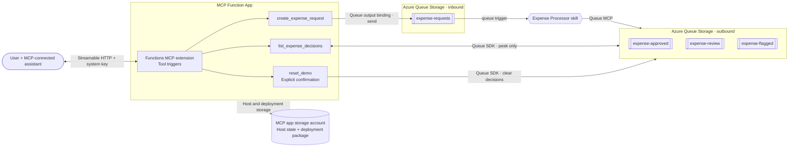

# Submit expenses with MCP server

Submit expense requests in natural language through an AI assistant using the MCP server built with
the [Azure Functions MCP extension](https://learn.microsoft.com/azure/azure-functions/functions-bindings-mcp).
The assistant calls tools to submit requests and list decisions. The Expense Processor hosted skill
extracts expense details, applies policy, and makes the approval decision.

The Functions MCP extension allows developers to build and host MCP servers using the familiar
programming model of triggers and bindings. Find more samples at
[aka.ms/remote-mcp](https://aka.ms/remote-mcp).

## Tools in MCP server

| Tool | Behavior |
|---|---|
| `create_expense_request(request)` | Submits an expense for evaluation and returns its request ID. |
| `list_expense_decisions()` | Shows available expense decisions grouped as approved, needs review, and flagged. |
| `reset_demo(confirm)` | Clears demo decisions after your confirmation so you can run the demo again. Does not cancel pending requests. |

## Deploy and connect

Deploy the sample using the [quickstart](../README.md#quickstart).
Follow [Test the expense processor](../README.md#test-the-expense-processor) for VS Code Copilot
connection instructions, example requests, and expected decisions.

## Submit a request

Example requests you can ask your agent:

> Submit an expense for my flight to the customer meeting. Contoso Air charged four hundred and fifty dollars. Preserve my original wording when submitting it.

> Submit an equipment expense: USD 450.00 for a monitor from Contoso Electronics.

> Submit a client entertainment expense: $450 for dinner with a customer at Contoso Bistro.

The agent will pick the appropriate tool from the MCP server to handle the user's request. The hosted skill
does the extraction and policy selection. Submission returns an ID immediately; allow up to two
minutes for processing before asking:

> List the available expense decisions and explain the policy and reason for each.

You can reset the demo by clearing the three output queues. Wait for processing to finish, then tell the assistant:

> Reset the demo results. I approve deleting all decisions in the three output queues.

The assistant should seek explicit approval before calling `reset_demo` with `confirm=true`.

## MCP server architecture

This diagram expands the MCP Function App from the [sample architecture](../README.md#how-it-works),
showing its tools and queue connections. The expense processor is shown only for context; its
policy lookup, AI Gateway, and Foundry model are detailed in the sample architecture.



In Azure, the three tools access the expense queues using the MCP app's managed identity.
`ExpenseInputStorage` connects the create tool to the input queue; `ExpenseStorage` connects the
list and reset tools to the output queues. Both use the same Azure queue endpoint and identity.
Locally, `ExpenseInputStorage` targets Azurite so the local hosted skill receives requests, while
`ExpenseStorage` uses your developer identity to access the Azure output queues.
These names identify connections, not additional storage accounts.
The MCP app's own storage account holds its host state (including MCP
transport state) and deployment package; `AzureWebJobsStorage` configures host access to it.
The MCP app does not call the hosted skill's
connectors or model. Listing leaves decisions in place, and reset clears only the output queues.
The inbound and outbound queues share the same expense storage account, as in the main README.

## Storage and identity boundary

The MCP Function App and its hosting and monitoring resources are in `rg-<environment>-mcp`.
Expense requests and decisions are stored in the processor's storage account in `rg-<environment>`,
accessed through the identity-based `ExpenseStorage` connection.
Submission uses `ExpenseInputStorage` with the same endpoint and identity in Azure.

| Scope | MCP app identity role |
|---|---|
| MCP app storage account | Storage Blob Data Owner, Storage Queue Data Contributor, and Storage Table Data Contributor for host and deployment storage |
| `expense-requests` only | Storage Queue Data Message Sender |
| Each of the three output queues | Storage Queue Data Contributor, enabling peek and clear |
| MCP app Application Insights | Monitoring Metrics Publisher |

The standard output-queue Contributor role is broader than peek/clear alone, but is scoped to
those three queues. Tools do not expose sending to output queues or arbitrary queue names.
The MCP identity has no access to policies, the AI Gateway, or the hosted skill's connectors.
For MCP tool invocation logs, open the MCP app's Application Insights; use the processor's
Application Insights for policy, model, and decision-routing activity.

## Run the MCP server locally

Follow [Run it locally](../README.md#run-it-locally) in the main README to configure and start
Azurite, the hosted skill, and the MCP server. The same tools and prompts work through the local
MCP endpoint; requests are processed locally using Azure model and policy services, and decisions
are written to Azure output queues.

## Validate the tools

The tests exercise the real Functions MCP wrappers and output-binding metadata, with mocked
storage clients so no Azure resources are changed:

```bash
uv run --project mcp-server python -m unittest discover -s mcp-server/tests -v
```

Deploy just the MCP app after changes with `azd deploy mcp`. The scripts are also available
for raw-input fixtures, policy changes, and operator inspection.

## Intentional limitations

- Listing is the same bounded snapshot as the script's `--peek` mode: **at most 32
  visible messages per output queue**, not full history. Repeating the call does not page forward.
- Requests still awaiting decisions are not listed. Absence does not prove a request never
  existed; it may be processing, outside the snapshot, expired, or previously consumed.
- Queue delivery and model processing are asynchronous and not exactly-once. Retrying creation
  generates a new request ID and can create duplicate expenses.